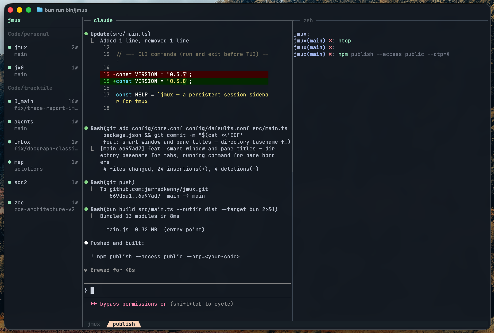
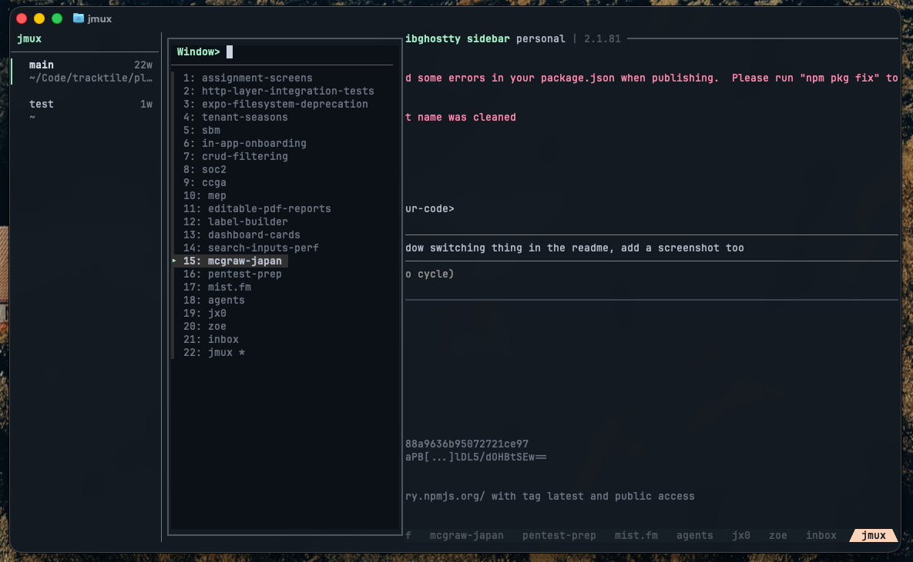

<div align="center">

# jmux

**The terminal workspace for agentic development.**

A tmux environment built for running coding agents in parallel — with a persistent sidebar that shows every session, what's running, and what needs your attention.

[](https://www.npmjs.com/package/@jx0/jmux)
[](LICENSE)



</div>

## Install

```bash
bun install -g @jx0/jmux
jmux
```

Requires [Bun](https://bun.sh) 1.2+, [tmux](https://github.com/tmux/tmux) 3.2+, [fzf](https://github.com/junegunn/fzf), and optionally [git](https://git-scm.com/) for branch display.

---

## Why

tmux sessions are invisible. You have 30 of them, but the status bar shows one name. To switch, you `prefix-s`, scan a wall of text, and hope you remember what's where.

jmux fixes this with a persistent sidebar that shows every session, all the time.

## Features

### Session Sidebar

Every session visible at a glance — name, window count, git branch. Sessions sharing a parent directory are automatically grouped under a header.

- Green `▎` left marker on the active session
- Green `●` dot for sessions with new output
- Orange `!` flag for attention (set programmatically)

### Instant Switching

`Ctrl-Shift-Up/Down` moves between sessions with zero delay. No prefix key, no menu, no mode to enter. Or just click a session in the sidebar.

### New Session Modal

`Ctrl-a n` opens a two-step fzf flow: fuzzy-search your git repos for a directory, then name the session. Pre-filled with the directory basename.

### Window Picker

`Ctrl-a j` opens a full-height fzf popup with every window in the current session. Type to filter, Enter to switch.



### Bring Your Own Config

jmux works with your existing `~/.tmux.conf`. Your plugins, theme, prefix key, and custom bindings carry over — jmux applies its defaults first, then your config overrides them. Only a small set of core settings the sidebar needs are enforced.

### Claude Code Integration

Built for agentic workflows. Run Claude Code in multiple sessions and get notified when each one finishes.

```bash
jmux --install-agent-hooks
```

One command adds a hook to `~/.claude/settings.json`. When Claude finishes a response, the orange `!` appears on that session. Switch to it, review the work, move on. See [docs/claude-code-integration.md](docs/claude-code-integration.md) for details.

---

## Keybindings

### Sessions

| Key | Action |
|-----|--------|
| `Ctrl-Shift-Up/Down` | Switch to prev/next session |
| `Ctrl-a n` | New session |
| `Ctrl-a r` | Rename session |
| `Ctrl-a m` | Move window to another session |
| Click sidebar | Switch to session |

### Windows

| Key | Action |
|-----|--------|
| `Ctrl-a j` | fzf window picker |
| `Ctrl-a c` | New window |
| `Ctrl-Right/Left` | Next/prev window |
| `Ctrl-Shift-Right/Left` | Reorder windows |

### Panes

| Key | Action |
|-----|--------|
| `Ctrl-a \|` | Split horizontal |
| `Ctrl-a -` | Split vertical |
| `Shift-Left/Right/Up/Down` | Navigate panes (vim-aware) |
| `Ctrl-a Left/Right/Up/Down` | Resize panes |
| `Ctrl-a P` | Toggle pane border titles |

### Utilities

| Key | Action |
|-----|--------|
| `Ctrl-a k` | Clear pane + scrollback |
| `Ctrl-a y` | Copy pane to clipboard |
| `Ctrl-a P` | Toggle pane border titles |

---

## Configuration

Config loads in three layers:

```
config/defaults.conf      ← jmux defaults (baseline)
~/.tmux.conf              ← your config (overrides defaults)
config/core.conf          ← jmux core (always wins)
```

Override any default in your `~/.tmux.conf` — prefix key, colors, keybindings, plugins. Only four core settings are enforced: `detach-on-destroy off`, `mouse on`, `prefix + n` binding, and empty `status-left`.

See [docs/configuration.md](docs/configuration.md) for the full guide.

---

## Architecture

```
Terminal (Ghostty, iTerm, etc.)
  └── jmux (owns the terminal surface)
       ├── Sidebar (24 cols) ── session groups, indicators
       ├── Border (1 col)
       └── tmux PTY (remaining cols)
            ├── PTY client ──── @xterm/headless for VT emulation
            └── Control client ─ tmux -C for real-time metadata
```

~1500 lines of TypeScript. No opinions about what you run inside tmux.

---

## License

[MIT](LICENSE)
