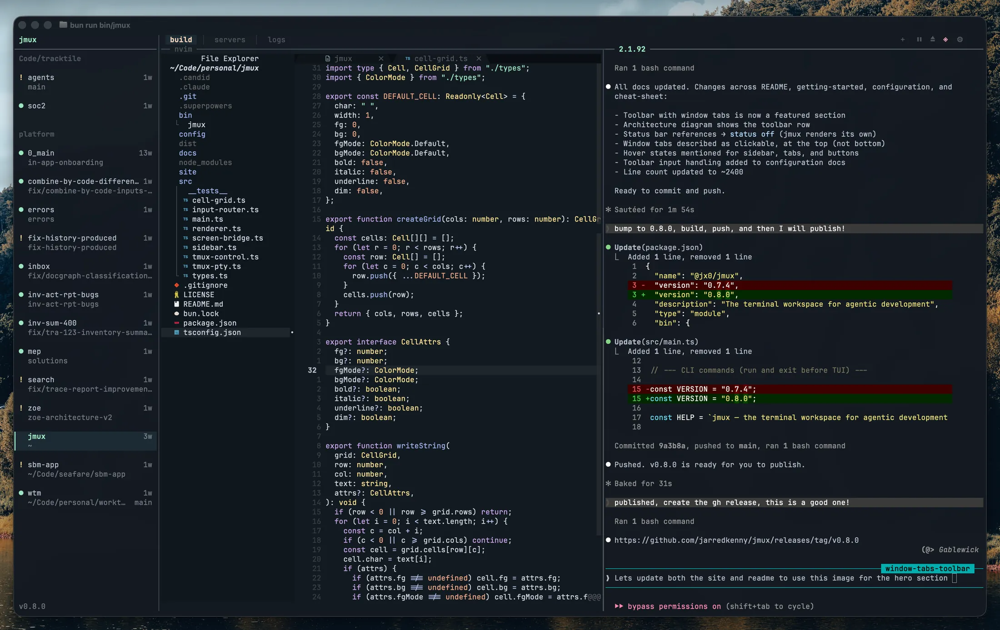
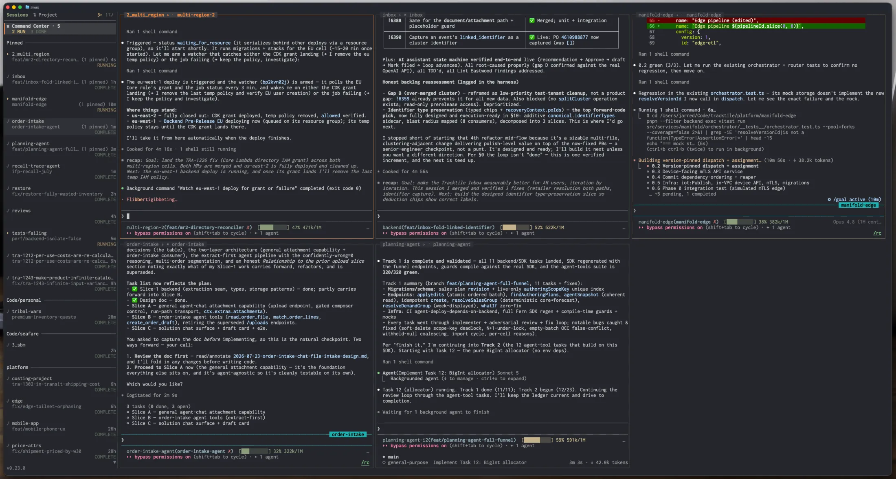
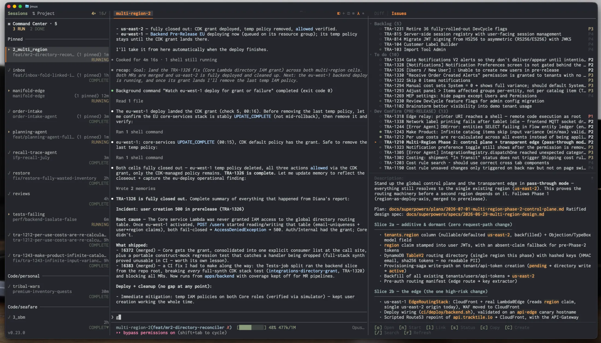
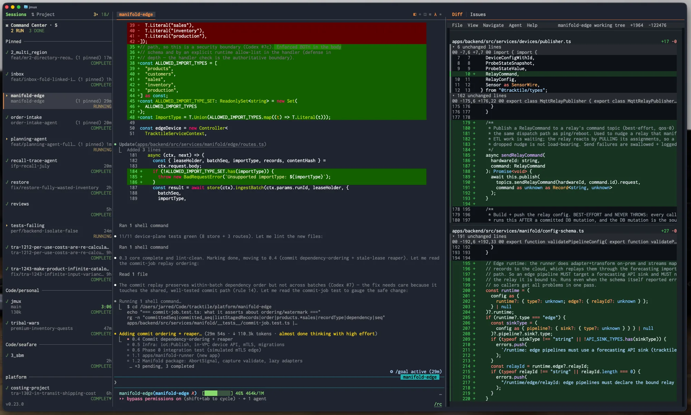
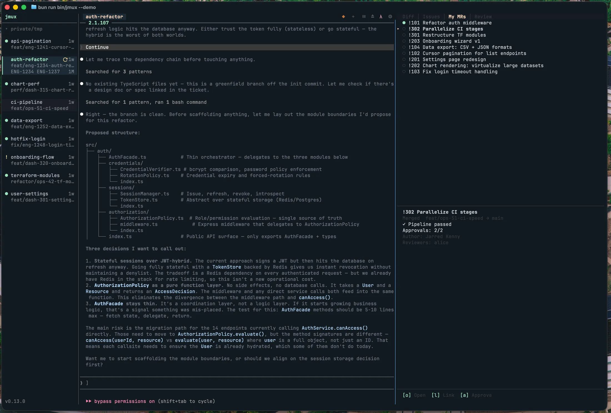

<div align="center">


# jmux

### Run a fleet of coding agents in parallel — and always know which one needs you.

Claude Code, Codex, or any agent — each in its own isolated session. jmux is the mission control that shows you who's working, who finished, and who's blocked on you.

[](https://www.npmjs.com/package/@jx0/jmux)
[](LICENSE)



```bash
bun install -g @jx0/jmux && jmux
```

</div>

Requires [Bun](https://bun.sh) 1.3.8+ and [tmux](https://github.com/tmux/tmux) 3.2+ — jmux offers to install tmux on first run. New to tmux? Start with the **[Getting Started guide](docs/getting-started.md)**.

> **Just want to look around?** `jmux --demo` runs with mock data — explore every feature, no credentials needed.

---

## 1 · Run agents in parallel, never lose track

Kicking off five agents is easy. Keeping track of them is the hard part — which one is still thinking, which one stopped to ask you a question, which one quietly finished ten minutes ago.

jmux answers that at a glance. The **sidebar** lists every session with live indicators, and the **Command Center** gives you a single grid of every agent you care about — each tile a live, drivable mirror of a pinned pane, its border colored by state so you see who needs you without hunting.



- **Green `●`** — new output.  **Orange `!`** — an agent finished and needs your review.
- **Pipeline glyphs** — `✓` passed, `⟳` running, `✗` failed, `◆` merged, right in the sidebar.
- **Pin any pane** into a named Command Center tab (`Backend`, `Review`, …) — panes stay in their own session, never moved or broken.
- **Jump between sessions** with `Ctrl-Shift-Up/Down`. Sessions sharing a project are grouped automatically.

`--install-agent-hooks` wires up the orange `!` for Claude Code in one command — [see how](docs/claude-code-integration.md).

---

## 2 · From ticket to merged, without leaving the terminal

Connect [Linear](https://linear.app) and [GitLab](https://about.gitlab.com) or [GitHub](https://github.com), open the info panel with `Ctrl-a g`, and the whole loop lives in your terminal:

**Pick an issue → press `n` → jmux creates a worktree, opens a session, and launches your agent with the issue context.** One keystroke from ticket to working code.



While it works, watch the sidebar. When it finishes, toggle the **integrated diff panel** to review the changes side-by-side with the agent's output.



Then flip to the **MRs tab** — approve, undraft, or update status without opening a browser. `o` opens anything in your browser, `s` updates an issue's status, `a` approves, `r` undrafts.



<details>
<summary><b>Setup</b> — Linear + GitLab / GitHub / GitHub Enterprise</summary>

```jsonc
// ~/.config/jmux/config.json
{
  "adapters": {
    "codeHost": { "type": "gitlab" },      // or "github"
    "issueTracker": { "type": "linear" }
  }
}
```

- **GitLab** — set `$LINEAR_API_KEY` and `$GITLAB_TOKEN`.
- **GitHub** — set `$LINEAR_API_KEY` and `$GH_TOKEN` (or `$GITHUB_TOKEN`; falls back to `gh auth token`). Token needs `repo` scope for PRs, check runs, reviews, and branch protection.
- **GitHub Enterprise** — add `"url": "https://github.mycompany.com/api/v3"` to the `github` adapter, or set `$GITHUB_ENTERPRISE_URL`.

Full guide: [docs/issue-tracking.md](docs/issue-tracking.md).
</details>

Each agent gets its own isolated branch via **[wtm](https://github.com/jarredkenny/worktree-manager)** — no stashing, no conflicts, no switching. `Ctrl-a n` → pick a project → **+ new worktree**.

---

## 3 · It's real tmux. Bring everything.

jmux wraps a real tmux process — it doesn't replace it. Your `~/.tmux.conf`, prefix key, plugins, theme, and custom bindings all carry over. Only a small set of core settings are enforced.

Use any editor. Any Git tool. Any AI agent. Any shell. No Electron. No proprietary runtime. **If it runs tmux, it runs jmux.**

---

## Agents that command agents

`jmux ctl` is a JSON API that lets an agent manage sibling sessions, windows, and panes — so one agent can dispatch, monitor, and chain others without a human in the loop.

```bash
# Spin up a session and launch Claude Code with a task
jmux ctl run-claude --name fix-auth --dir /repo --message "Fix the auth bug in src/auth.ts"

# Check whether it finished (attention flag = needs review)
jmux ctl session info --target fix-auth | jq .attention

# Send a follow-up prompt to a running agent
jmux ctl pane send-keys --target %12 "Now add tests for that fix"
```

jmux ships a [Claude Code skill](skills/jmux-control.md) that agents auto-discover inside jmux sessions — fan out parallel agents, poll for completion, capture output, and chain tasks. Run `jmux ctl --help` for the full command surface.

---

## More features

- **Command palette** (`Ctrl-a p`) — fuzzy-search sessions, windows, pane actions, settings, and issue/MR commands. ([screenshot](docs/screenshots/command-palette.webp))
- **Diff panel zoom** (`Ctrl-a z`) — blow the diff up to full-screen; the sidebar stays for session switching. ([screenshot](docs/screenshots/diff-panel-full.webp))
- **Built with the best** — [hunk](https://github.com/modem-dev/hunk) (diff viewer), [lazygit](https://github.com/jesseduffield/lazygit), [gh](https://cli.github.com/) / [glab](https://gitlab.com/gitlab-org/cli). Run any of them in a pane alongside your agent.

## Keybinding essentials

| Key | Action |
|-----|--------|
| `Ctrl-Shift-Up/Down` | Switch to prev/next session |
| `Ctrl-a n` | New session / worktree |
| `Ctrl-a p` | Command palette |
| `Ctrl-a g` | Toggle info panel (Diff / Issues / MRs / Review) |
| `Ctrl-a \|` / `Ctrl-a -` | Split pane horizontal / vertical |
| `Ctrl-a z` | Zoom pane or diff panel |

**Full keybinding reference → [docs/cheat-sheet.md](docs/cheat-sheet.md)**

## Configuration

jmux layers tmux config in three tiers — jmux defaults, then your `~/.tmux.conf`, then the small set of settings jmux requires. jmux's own settings live in `~/.config/jmux/config.json`. Full guide: **[docs/configuration.md](docs/configuration.md)**.

## Architecture

jmux drives a real tmux process over two channels (an interactive PTY client and a control-mode client) and composites its own sidebar and toolbar around the output. The full design — the two-channel model, rendering pipeline, and adapters — is in **[docs/architecture.md](docs/architecture.md)**.

---

## License

[MIT](LICENSE)
