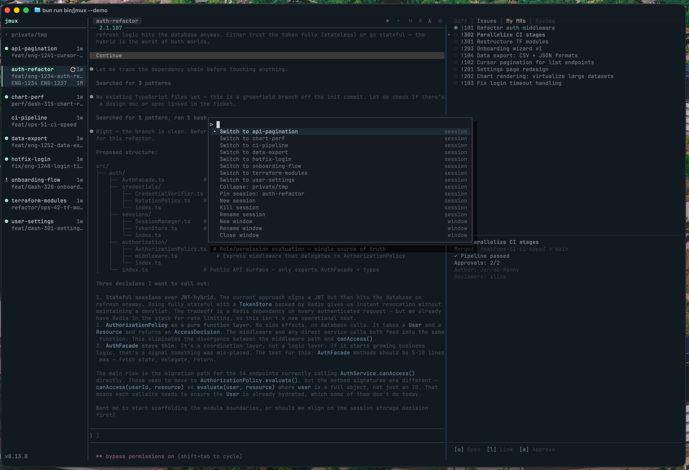
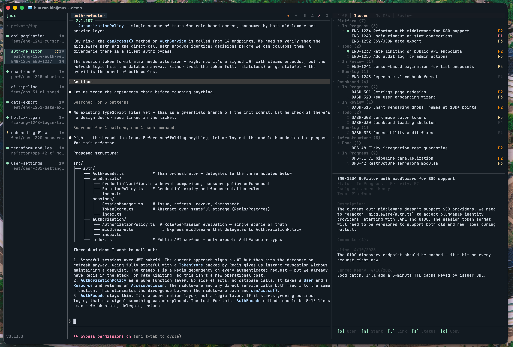
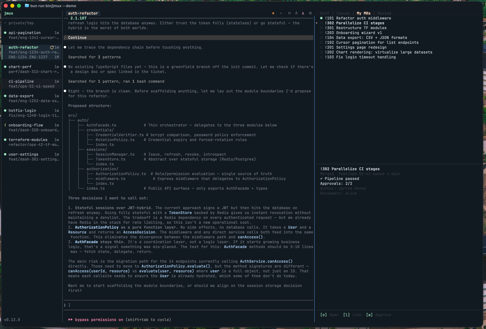
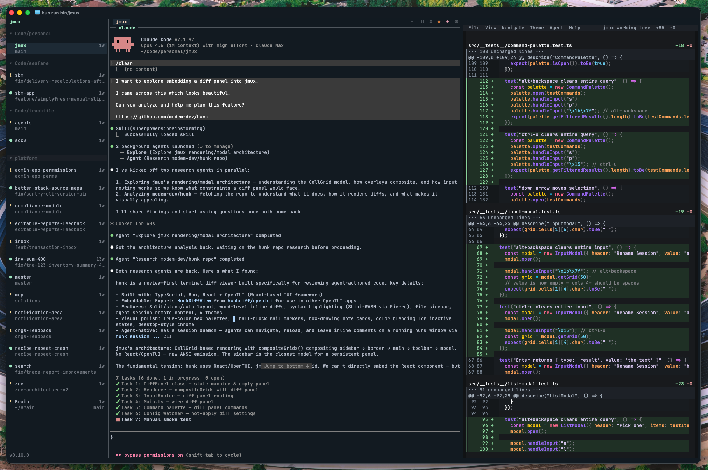
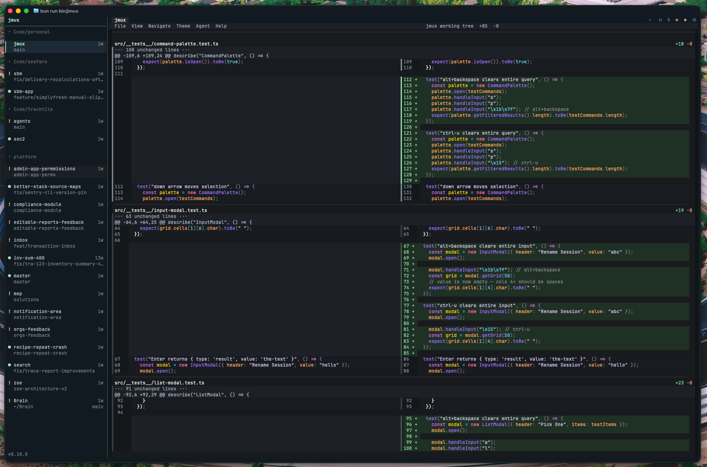

<div align="center">


# jmux

**The agent orchestrator that doesn't replace your tools.**

Agent IDEs ship their own terminal, diff viewer, and worktree manager — then lock you in. jmux orchestrates tmux, hunk, wtm, and whatever else you already use. Your tools stay your tools.

[](https://www.npmjs.com/package/@jx0/jmux)
[](LICENSE)


</div>

## Install

```bash
bun install -g @jx0/jmux
jmux
```

Requires [Bun](https://bun.sh) 1.2+, [tmux](https://github.com/tmux/tmux) 3.2+, and optionally [git](https://git-scm.com/) for branch display. jmux will offer to install tmux for you on first run.

New to tmux? See the **[Getting Started guide](docs/getting-started.md)** — no prior tmux knowledge needed.

---

## Why

Your workflow shouldn't change because you added an orchestrator.

**Your diff viewer is better than theirs.** Agent IDEs bundle their own diff panel. jmux integrates [hunk](https://github.com/modem-dev/hunk) — syntax-highlighted, word-level, split and full-screen views. Built by people who only build diff viewers.

**Your worktrees are real worktrees.** jmux doesn't invent its own branching model. It uses [wtm](https://github.com/jarredkenny/worktree-manager) and git worktrees — one branch per agent, one session per branch. If you stop using jmux, the branches are still there.

**Your terminal is your terminal.** Your theme, your keybinds, your plugins, your `~/.tmux.conf`. jmux runs in any terminal you already have — local, SSH, containers, devboxes. No Electron shell. No proprietary runtime. If it runs tmux, it runs jmux.

## Features

### Session Sidebar

Every session visible at a glance — name, window count, git branch, pipeline status, linked issues. Sessions sharing a parent directory are automatically grouped under a header. Mouse wheel scrolling when sessions overflow.

- Green `▎` marker + highlighted background on the active session
- Green `●` dot for sessions with new output
- Orange `!` flag for attention (e.g., an agent finished and needs review)
- Pipeline glyphs: `✓` passed, `⟳` running, `✗` failed, `◆` merged
- Linked issue identifiers (e.g., `ENG-1234`) and MR count on a third row

### Toolbar with Window Tabs

The top toolbar shows clickable window tabs on the left and action buttons on the right — new window, split panes, launch Claude Code, settings. The active tab is highlighted in peach, inactive tabs are dim with separators between them. Hover states on everything. tmux's status bar is fully replaced.

### Smart Pane Titles

Pane borders show the running command with automatic detection for tools like Claude Code. Window tabs auto-name to the working directory. No more tabs full of `zsh` or garbled version strings.

### Command Palette

Press `Ctrl-a p` to open a fuzzy-searchable command palette — switch sessions, manage windows and panes, change settings, all without remembering keybindings.



Type to filter, arrow keys to navigate, Enter to execute. Settings like sidebar width drill into sub-lists with selectable values. Escape backs out or closes.

### Instant Switching

`Ctrl-Shift-Up/Down` moves between sessions with zero delay. No prefix key, no menu, no mode to enter. Or just click a session in the sidebar. Click a window tab to switch windows. Hover states on sidebar sessions, toolbar tabs, and action buttons. Indicators only clear when you actually interact with a session — not when you're cycling through.

### New Session Modal

`Ctrl-a n` opens a two-step flow: fuzzy-search your git repos for a directory, then name the session. Pre-filled with the directory basename.

### Bring Your Own Everything

jmux works with your existing `~/.tmux.conf`. Your plugins, theme, prefix key, and custom bindings carry over. jmux applies its defaults first, then your config overrides them. Only a small set of core settings are enforced.

Use any editor. Any Git tool. Any AI agent. Any shell. jmux integrates the best and organizes the rest.

### Worktree-Native Workflows

jmux integrates with **[wtm](https://github.com/jarredkenny/worktree-manager)** to give each agent its own isolated branch — no stashing, no conflicts, no switching.

```bash
bun install -g @jx0/wtm     # one-time setup
wtm init git@github.com:you/repo.git
```

Then from jmux, press `Ctrl-a n`, select your project, and choose **+ new worktree**. jmux walks you through picking a base branch and naming the worktree, then opens a split-pane session with the setup running on the left and a ready shell on the right.

The sidebar automatically detects worktrees and groups sessions by project. Each worktree shows its branch name — you see at a glance which agent is working on which branch.

**The workflow:** spin up 5 worktrees from `main`, start Claude Code in each one, and let them work in parallel on different features. Review each one when the `!` flag appears. Merge the good ones.

### Issue Tracking & MR Panel

Connect [Linear](https://linear.app) and [GitLab](https://about.gitlab.com) to see your issues, merge requests, and pipeline status directly in jmux. The info panel docks to the right side of the terminal with tabbed views.



**What you get:**
- **My Issues** — issues assigned to you, grouped by team and status, sorted by priority
- **My MRs** — merge requests you authored, with pipeline status and approval counts
- **Review** — MRs awaiting your review



Each session automatically links to its branch's MR and associated issues. Select an issue and press `n` to spin up a new worktree session with the agent pre-loaded with the issue context. Press `o` to open anything in your browser, `s` to update an issue's status, `a` to approve an MR — all without leaving the terminal.

**Setup:**

```json
// ~/.config/jmux/config.json
{
  "adapters": {
    "codeHost": { "type": "gitlab" },
    "issueTracker": { "type": "linear" }
  }
}
```

Set `$LINEAR_API_KEY` and `$GITLAB_TOKEN` in your environment. See [docs/issue-tracking.md](docs/issue-tracking.md) for the full guide.

### Integrated Diff Panel

Press `Ctrl-a g` to open an embedded [hunk](https://github.com/modem-dev/hunk) diff panel — the best terminal diff viewer, integrated directly into jmux for reviewing agent-authored changes without leaving your workspace.



Two modes:
- **Split** — diff panel docks to the right. See agent output and code changes simultaneously.
- **Full** — `Ctrl-a z` zooms the diff to take over the main area, just like zooming a tmux pane. Sidebar stays for session switching.

`Ctrl-a g` toggles the panel on/off. Click or `Shift-Right` to focus it for keyboard navigation (`j`/`k` to scroll, `[`/`]` to jump between hunks). `Ctrl-a z` zooms to full-screen while focused. `Shift-Left` returns focus to tmux. Switching sessions automatically reloads the diff.



Requires `hunkdiff` (`npm i -g hunkdiff`). If not installed, jmux shows an install hint when you toggle the panel.

### Built With the Best

- **[hunk](https://github.com/modem-dev/hunk)** — The best terminal diff viewer. Powers jmux's integrated diff panel — syntax-highlighted, word-level diffs with split and full-screen views
- **[Claude Code](https://docs.anthropic.com/en/docs/claude-code)** — The leading AI coding agent. jmux reads its telemetry for cache timers and attention flags — no configuration required
- **[Linear](https://linear.app)** — Modern issue tracking. jmux pulls your assigned issues, links them to sessions, and updates statuses — all from the terminal
- **[GitLab](https://about.gitlab.com)** — jmux shows MR status, pipeline results, and approval state in the sidebar and info panel. Approve and undraft MRs without opening a browser
- **[lazygit](https://github.com/jesseduffield/lazygit)** — The best terminal Git UI. Run it in a jmux pane alongside your agent
- **[gh](https://cli.github.com/)** / **[glab](https://gitlab.com/gitlab-org/cli)** — The standard GitHub and GitLab CLIs. PRs, issues, and reviews without leaving the terminal

### Agent Integration

Built for running multiple coding agents in parallel. One command sets up attention notifications:

```bash
jmux --install-agent-hooks
```

When Claude Code finishes a response, the orange `!` appears on that session in the sidebar. Switch to it, review the work, move on. Works with any agent that can run a shell command on completion. See [docs/claude-code-integration.md](docs/claude-code-integration.md) for details.

### Agent Control CLI

`jmux ctl` is a programmatic JSON API that lets agents running inside jmux manage sibling sessions, windows, and panes. Agents can spin up other agents, monitor their progress, and interact with them — all without human intervention.

```bash
# Create a session and launch Claude Code with a task
jmux ctl run-claude --name fix-auth --dir /repo --message "Fix the auth bug in src/auth.ts"

# Check if an agent finished (attention flag = needs review)
jmux ctl session info --target fix-auth | jq .attention

# Capture what's on screen in another pane
jmux ctl pane capture --target %12

# Send a follow-up prompt to a running agent
jmux ctl pane send-keys --target %12 "Now add tests for that fix"
```

Subcommands: `session` (list/create/kill/rename/switch/info/set-attention), `window` (list/create/select/kill), `pane` (list/split/send-keys/capture/kill), `run-claude` (dispatch Claude Code in a new session).

All output is JSON. Context (socket, session) is auto-detected from `$TMUX` when running inside jmux.

```bash
jmux ctl --help              # Full usage
jmux ctl session list        # List all sessions as JSON
```

### Agent Skills

jmux ships a [Claude Code skill](skills/jmux-control.md) that agents auto-discover when running inside a jmux session. The skill teaches agents the full `jmux ctl` API — commands, conventions, response shapes, and multi-agent patterns like fan-out and pipeline orchestration.

When `$JMUX=1` is set (automatic inside jmux), Claude Code can use the skill to dispatch parallel agents, poll for completion via attention flags, capture pane output, and chain tasks together — no human prompting required.

---

## Keybindings

### Sessions

| Key | Action |
|-----|--------|
| `Ctrl-Shift-Up/Down` | Switch to prev/next session |
| `Ctrl-a n` | New session |
| `Ctrl-a r` | Rename session |
| `Ctrl-a m` | Move window to another session |
| Click sidebar | Switch to session |
| Scroll wheel (sidebar) | Scroll session list |

### Windows

| Key | Action |
|-----|--------|
| Click tab | Switch to window |
| `Ctrl-a c` | New window |
| `Ctrl-Right/Left` | Next/prev window |
| `Ctrl-Shift-Right/Left` | Reorder windows |

### Panes

| Key | Action |
|-----|--------|
| `Ctrl-a \|` | Split horizontal |
| `Ctrl-a -` | Split vertical |
| `Shift-Left/Right/Up/Down` | Navigate panes (vim-aware) |
| `Ctrl-a Left/Right/Up/Down` | Resize panes |
| `Ctrl-a z` | Toggle pane zoom |


### Info Panel

| Key | Action |
|-----|--------|
| `Ctrl-a g` | Toggle info panel on/off |
| `[` / `]` | Cycle tabs (Diff, Issues, MRs, Review) |
| `Ctrl-a z` | Zoom panel (split ↔ full, when focused) |
| `Ctrl-a Tab` | Switch focus between tmux and panel |
| `Shift-Right` | Focus panel from rightmost pane |
| `Shift-Left` | Return focus to tmux from panel |
| `↑` / `↓` | Navigate items in issue/MR views |
| `o` | Open selected item in browser |
| `n` | Start session from selected issue |
| `l` | Link selected item to current session |
| `s` | Update issue status |
| `a` | Approve MR |
| `r` | Mark MR ready (undraft) |
| `g` / `G` | Cycle group-by / sub-group-by |
| `/` / `?` | Cycle sort field / toggle sort order |

### Utilities

| Key | Action |
|-----|--------|
| `Ctrl-a p` | Command palette |
| `Ctrl-a k` | Clear pane + scrollback |
| `Ctrl-a y` | Copy pane to clipboard |
| `Ctrl-a i` | Settings |

---

## Configuration

Config loads in three layers:

```
config/defaults.conf      <- jmux defaults (baseline)
~/.tmux.conf              <- your config (overrides defaults)
config/core.conf          <- jmux core (always wins)
```

Override any default in your `~/.tmux.conf` — prefix key, colors, keybindings, plugins. Only core settings jmux depends on are enforced (`mouse on`, `detach-on-destroy off`, window naming, `status off` since jmux renders its own toolbar).

See [docs/configuration.md](docs/configuration.md) for the full guide.

---

## Architecture

```
Terminal (Ghostty, iTerm, etc.)
  +-- jmux (owns the terminal surface)
       +-- Sidebar (26 cols) -- session groups, indicators, pipeline glyphs
       +-- Border (1 col)
       +-- Main area (remaining cols)
       |    +-- Toolbar (row 0) -- window tabs (left), action buttons (right)
       |    +-- tmux PTY (remaining rows)
       |         +-- PTY client ---- @xterm/headless for VT emulation
       |         +-- Control client - tmux -C for real-time metadata
       +-- Info Panel (optional, split/full)
       |    +-- Tab bar ------------ Diff | Issues | MRs | Review
       |    +-- hunk PTY ----------- @xterm/headless (Diff tab)
       |    +-- Panel views -------- grouped/sorted item lists (other tabs)
       +-- Adapters
       |    +-- Linear ------------- issues, statuses, comments (GraphQL)
       |    +-- GitLab ------------- MRs, pipelines, approvals (REST)
       |    +-- Poll coordinator --- tiered polling, rate-limit backoff
       +-- jmux ctl (JSON API, used by agents inside sessions)
            +-- session / window / pane / run-claude
```

No opinions about what you run inside tmux.

---

## License

[MIT](LICENSE)
