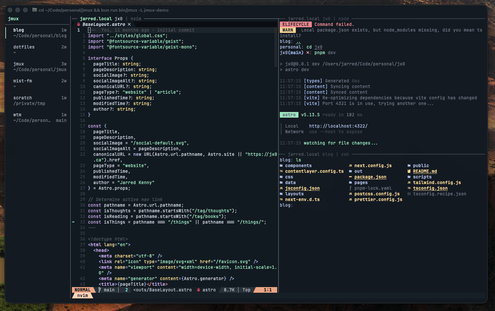

# jmux

A persistent session sidebar for tmux. See every project at a glance, switch instantly, never lose context.


---

## The Problem

You have 30+ tmux sessions. Each one is a project, a context, a train of thought. But tmux gives you a flat list and a status bar that shows one session name. To switch, you `prefix-s`, scan a wall of text, find the one you want, and hope you remember which window you were in.

You lose context constantly. You forget what's running where. You can't see at a glance which sessions have new output or which ones need attention.

## The Solution

jmux wraps tmux with a persistent sidebar that shows all your sessions, all the time. It works with your existing `~/.tmux.conf` — your plugins, your colors, your keybindings — and layers a sidebar on top.

**What you get:**
- Every session visible at all times with git branch and window count
- Sessions grouped by project directory — related work stays together
- Instant switching with `Ctrl-Shift-Up/Down` — no prefix, no menu, no delay
- Activity indicators (green dot) and attention flags (orange `!`) for agentic workflows
- Mouse click to switch sessions
- New session modal with fuzzy directory picker
- Bring your own `~/.tmux.conf` — your plugins and keybindings just work



## How It Works

jmux owns the terminal. It spawns tmux in a PTY, feeds the output through a headless terminal emulator ([xterm.js](https://xtermjs.org/)), and composites a 24-column sidebar alongside the tmux rendering. A separate tmux control mode connection provides real-time session metadata via push notifications.

jmux sources your `~/.tmux.conf` first, then layers its own defaults and the few settings the sidebar requires. Your existing setup carries over — jmux just adds the sidebar.

```
┌─ jmux sidebar ──┬─ your normal tmux ──────────────────────┐
│                  │                                         │
│  jmux            │  $ vim src/server.ts                    │
│ ──────────────── │  ...                                    │
│ Code/work        │                                         │
│ ▎ api-server  3w │                                         │
│              main│                                         │
│                  │                                         │
│   dashboard   1w │                                         │
│            feat/x│                                         │
│                  │                                         │
│ Code/personal    │                                         │
│ ● blog        1w │                                         │
│                  │                                         │
│   dotfiles    2w │                                         │
│                  ├─────────────────────────────────────────┤
│                  │  1:vim  2:zsh  3:bun                    │
└──────────────────┴─────────────────────────────────────────┘
```

### Sidebar Features

**Session grouping** — Sessions that share a parent directory are automatically grouped under a header. `~/Code/work/api` and `~/Code/work/web` group under `Code/work`. Solo sessions render ungrouped.

**Two-line entries** — Each session shows its name and window count on the first line, git branch on the second. Grouped sessions inherit directory context from the group header. Ungrouped sessions show their directory path.

**Visual indicators:**
- Green `▎` left marker — active session
- Green `●` dot — new output since you last viewed that session
- Orange `!` flag — attention needed (set programmatically)

## Installation

```bash
# Install globally
bun install -g @jx0/jmux

# Run
jmux
```

### Requirements

- [Bun](https://bun.sh) 1.2+
- [tmux](https://github.com/tmux/tmux) 3.2+
- [fzf](https://github.com/junegunn/fzf) (for new session modal)
- [git](https://git-scm.com/) (optional, for branch display)

### Usage

```bash
# Start jmux (creates or attaches to default session)
jmux

# Start with a named session
jmux my-project

# Use a separate tmux server (won't touch your existing sessions)
jmux -L work
```

### From Source

```bash
git clone https://github.com/jarredkenny/jmux.git
cd jmux
bun install
bun run bin/jmux
```

## New Session Modal

Press `Ctrl-a n` to create a new session. The modal walks you through two steps:

1. **Pick a directory** — fuzzy search over all git repos found under `~/Code`, `~/Projects`, `~/src`, `~/work`, and `~/dev`. Start typing to narrow down instantly.

2. **Name the session** — pre-filled with the directory basename. Edit or accept with Enter.

The session is created in the selected directory and the sidebar updates immediately. The new session is auto-selected.

## Keybindings

### Session Navigation (always active)

| Key | Action |
|-----|--------|
| `Ctrl-Shift-Up` | Switch to previous session |
| `Ctrl-Shift-Down` | Switch to next session |
| `Ctrl-a n` | New session (directory picker + name) |
| Click sidebar | Switch to that session |

### Windows

| Key | Action |
|-----|--------|
| `Ctrl-a c` | New window (opens in `~`) |
| `Ctrl-a j` | fzf window picker |
| `Ctrl-Right` / `Ctrl-Left` | Next / previous window |
| `Ctrl-Shift-Right` / `Ctrl-Shift-Left` | Reorder windows |

`Ctrl-a j` opens a full-height fzf popup on the left side of the screen with all windows in the current session. Type to fuzzy search, Enter to switch.


### Panes

| Key | Action |
|-----|--------|
| `Ctrl-a \|` | Split horizontal |
| `Ctrl-a -` | Split vertical |
| `Shift-arrows` | Navigate panes |
| `Ctrl-a arrows` | Resize panes |
| `Ctrl-a P` | Toggle pane border titles |

### Utilities

| Key | Action |
|-----|--------|
| `Ctrl-a k` | Clear pane screen and scrollback |
| `Ctrl-a y` | Copy entire pane to clipboard |

## Claude Code Integration

jmux is built for agentic workflows. When you have Claude Code running in multiple sessions, you need to know which ones need your attention.

### One-Command Setup

```bash
jmux --install-agent-hooks
```

This adds a hook to `~/.claude/settings.json` that sets the attention flag whenever Claude Code finishes a response. The orange `!` appears in your sidebar so you know which session to check.

### Manual Setup

Set an attention flag on any session:

```bash
tmux set-option -t my-session @jmux-attention 1
```

jmux shows an orange `!` indicator. When you switch to that session, the flag clears automatically.

### Workflow

1. Start jmux
2. Create sessions for each project (`Ctrl-a n`)
3. Run Claude Code in each session on different tasks
4. Work in one session while others run in the background
5. Orange `!` flags appear when Claude finishes — switch instantly with `Ctrl-Shift-Down`

## Configuration

jmux loads config in three layers:

```
config/defaults.conf      ← jmux defaults (baseline)
~/.tmux.conf              ← your config (overrides defaults)
config/core.conf          ← jmux requirements (always wins)
```

jmux defaults are applied first as a baseline. Your `~/.tmux.conf` is sourced next — anything you set overrides the defaults. Finally, the core settings the sidebar depends on are applied last and cannot be overridden.

**Core settings** (cannot be overridden):
- `detach-on-destroy off` — switch to next session on kill, don't exit jmux
- `mouse on` — required for sidebar clicks
- `prefix + n` — new session modal
- Empty `status-left` — session info is in the sidebar

Everything else is yours to customize. See [docs/configuration.md](docs/configuration.md) for details.

## Architecture

```
Terminal (Ghostty, iTerm, etc.)
  └── jmux (owns the terminal surface)
       ├── Sidebar (24 cols) ── session groups, indicators, navigation
       ├── Border (1 col) ──── vertical separator
       └── tmux PTY (remaining cols)
            ├── PTY client ──── spawns tmux, feeds output through @xterm/headless
            └── Control client ─ tmux -C for real-time session metadata
```

jmux is ~1500 lines of TypeScript. It has no opinions about what you run inside tmux.

## License

MIT
